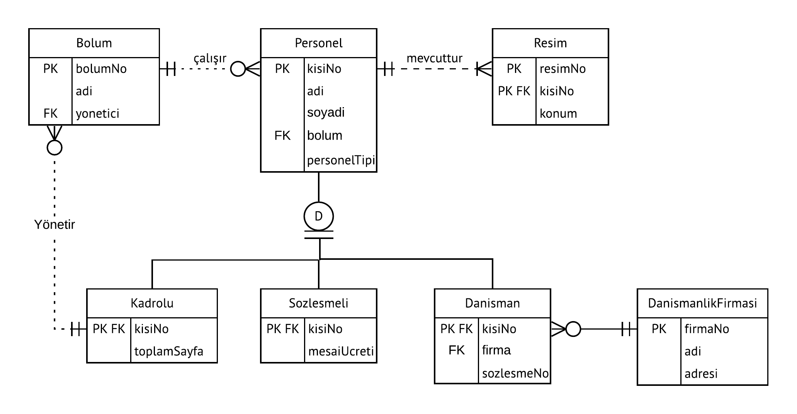
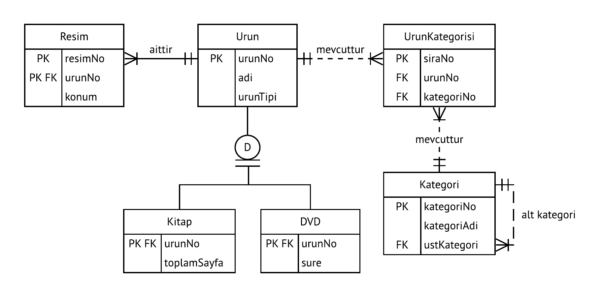
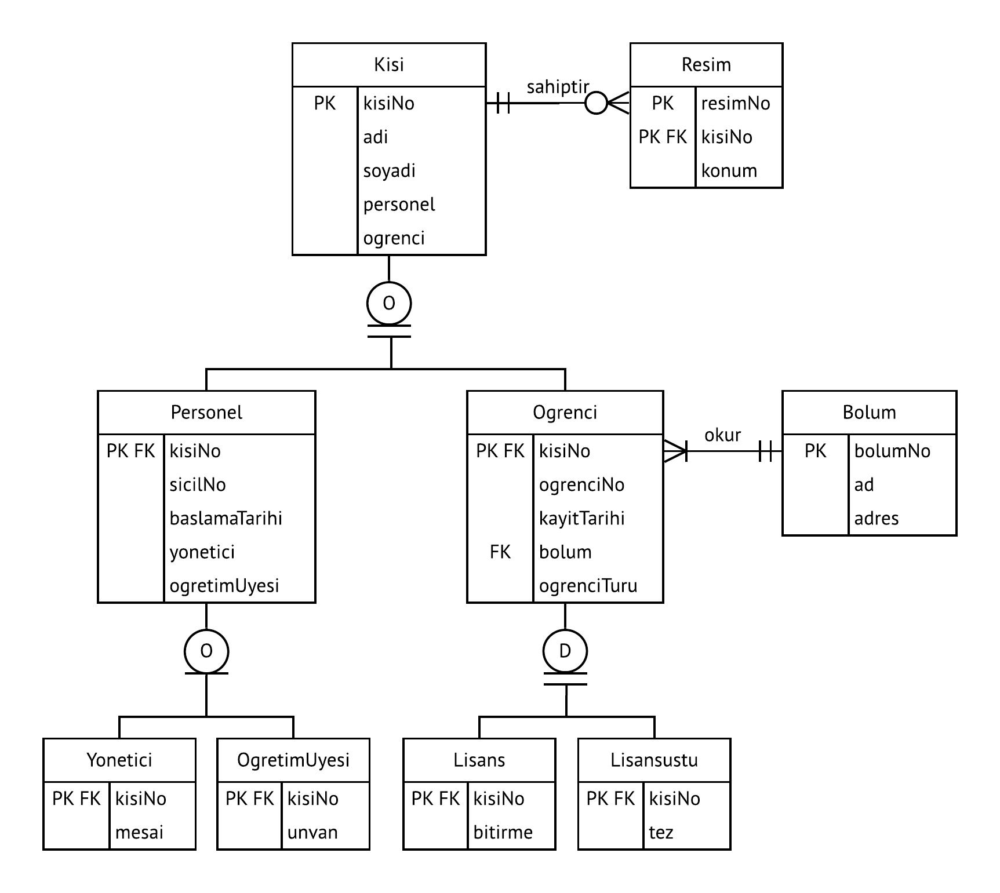
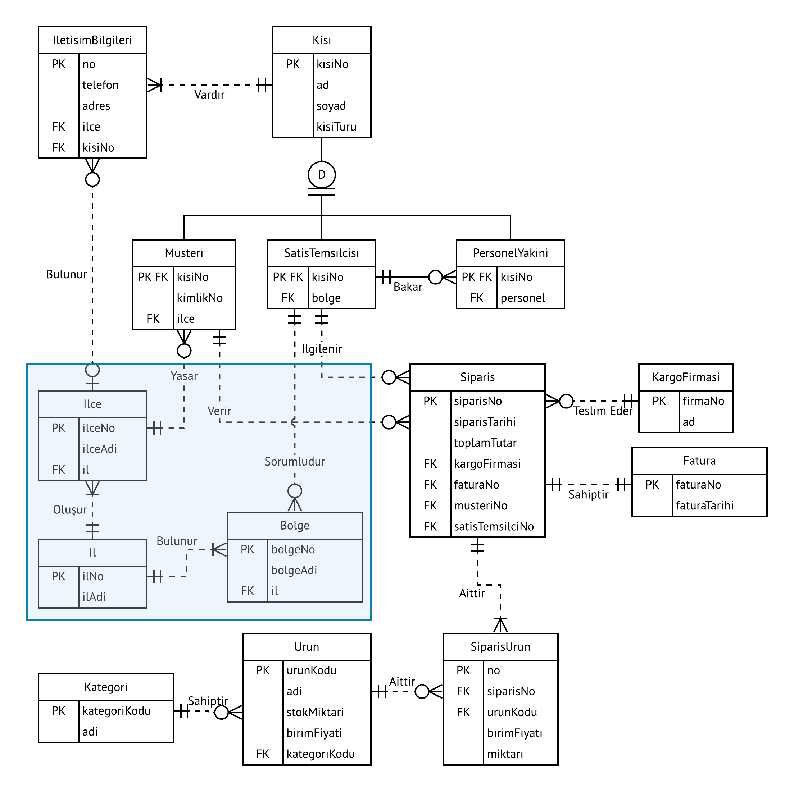
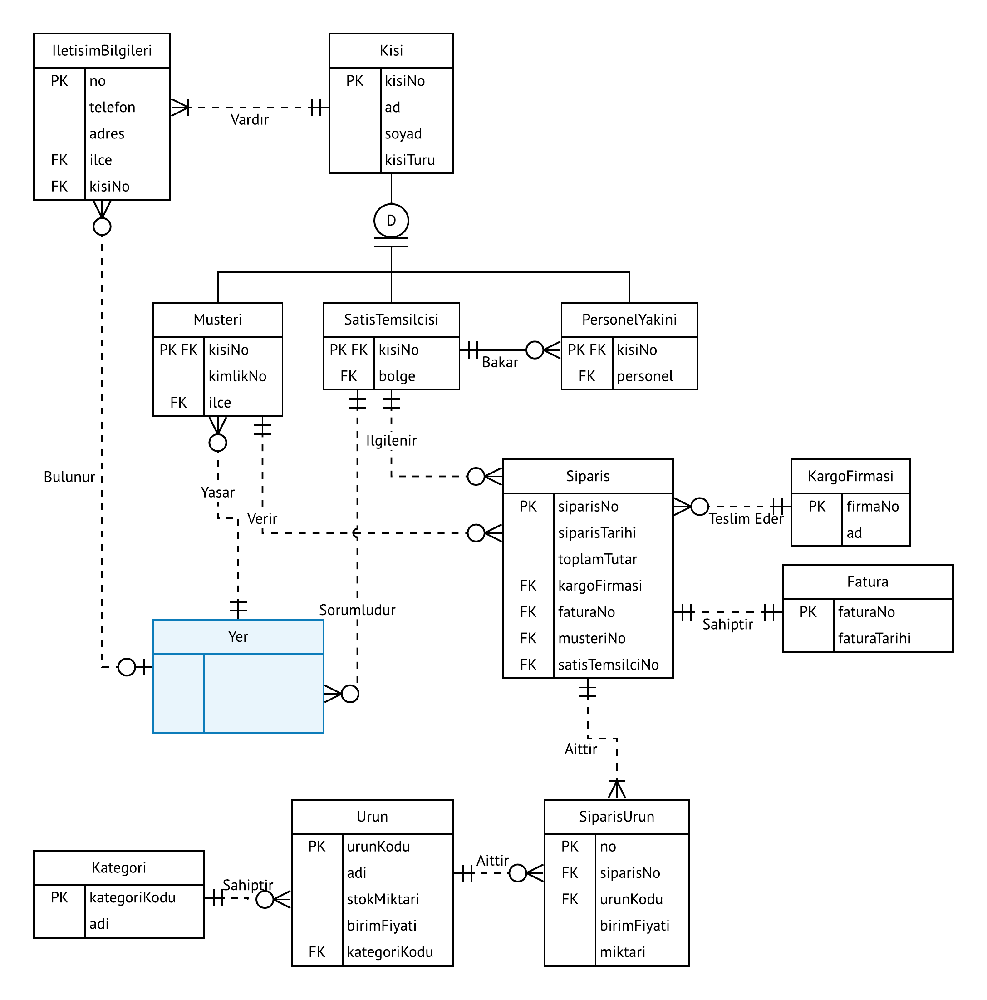

# VYS05\_1

BSM211 Veritabanı Yönetim Sistemleri - Celal ÇEKEN, İsmail ÖZTEL, Veysel Harun ŞAHİN

## Genişletilmiş Varlık Bağıntı Modeli

### Konular

* Genelleme \(Kalıtım\)
  * Çakışan \(Overlap\)
  * Ayrık \(Disjoint\)
  * Kısmi Bütünlük \(Partial Completeness\)
  * Toplam Bütünlük \(Total Completeness\)
* Kümeleme

### Genelleme \(Kalıtım\)

* Bir veritabanı içerisinde benzer özelliklere sahip varlıklar için ortak alanları içeren temel bir varlık oluşturulabilir ve diğer varlıklar bu temel varlıktan türetilebilir.
* Bunun çeşitli avantajları vardır.
  * Değişikliklerin kolay yapılabilmesi
  * Hızlı tasarım
  * Anlaşılabilirliğin artması vb.
* NYP paradigmasındaki kalıtım özelliğine benzer.

#### Temel Kavramlar

* **Çakışan \(Overlap\)**
  * **Gösterim: O**
  * Aynı temel varlıkla ilgili birden fazla çocuk varlık olabilir.
  * Örneğin öğrenci bilgi sistemindeki bir kişinin hem personel hem de öğrenci olabilmesi.
* **Ayrık \(Disjoint\)**
  * **Gösterim: D**
  * Aynı temel varlıkla ilgili tek bir çocuk varlık olabilir.
  * Örneğin e-ticaret uygulamasındaki bir kişinin ya müşteri ya da personel olabilmesi, her ikisi birden olamaması.
* **Kısmi Bütünlük \(Partial Completeness\)** 
  * **Gösterim: Tek Çizgi** 
  * Üst tip \(supertype\) kayıtlar, alt tip \(subtype\) kayıtlar olmadan da mevcut olabilir.
* **Toplam Bütünlük \(Total Completeness\)** 
  * **Gösterim: Çift Çizgi**
  * Her üst tip \(supertype\) kaydın, mutlaka en az bir alt tip \(subtype\) kaydı olmalı.

#### Örnek 1

#### Örnek 2

#### Örnek 3

#### Örnek 4

### Kümeleme

* VB diyagramlarını basitleştirmek ve okunabilirliğini artırmak için, çok sayıda varlık ve bağıntıları yerine sanal varlık kullanılamsı işine kümeleme denir.

### Kaynaklar

* Carlos Coronel, Steven Morris, and Peter Rob, Database Systems: Design, Implementation, and     Management, Cengage Learning.

