# VYS05\_2

BSM211 Veritabanı Yönetim Sistemleri - Celal ÇEKEN, İsmail ÖZTEL, Veysel Harun ŞAHİN

## İlişkisel Cebir

### Konular

* Biçimsel Sorgulama Dilleri
* İlişkisel Cebir
* İlişkisel Cebir İşlemleri
* Seçme \(selection\) işlemi 
* Projeksiyon \(projection\) işlemi 
* Küme birleşimi \(set union\) işlemi 
* Küme kesişimi \(set intersection\) işlemi 
* Küme farkı \(set difference\) işlemi 
* Kartezyen çarpım \(Cartesian product\) işlemi 
* Birleştirme \(join\) işlemi 
* Bölme \(division\) işlemi
* Uygulamalar

### Biçimsel Sorgulama Dilleri

* Sorgular sembollerle ifade edilir.
* İlişkisel modelde sıklıkla kullanılan iki biçimsel sorgulama dili vardır: İlişkisel Cebir \(Relational Algebra\) ve İlişkisel Hesap \(Relational Calculus\).
  * Bu diller biçimseldir. Herhangi bir yorumlayıcı veya derleyici yoktur.
  * Bu diller, SQL \(Structured Query Language\) ve QBE \(Query By Example\) dillerinin temelini oluştururlar.
* **İlişkisel Cebir \(Relational Algebra\):** Prosedüreldir \(procedural\) ve sorguların hangi adımlardan oluştuğu açıkça ifade edilir.
  * Öğrenciler ve İller tablosunu birleştir.
  * İli Sakarya olan öğrencileri seç.
  * Bu öğrencilerin numara, ad ve soyad bilgilerini göster.
* **İlişkisel Hesap \(Relational Calculus\):** Prosedürel değildir. Bildirimseldir \(declarative\). Kullanıcıların ne istediklerini bildirmelerine olanak tanır. Nasıl hesaplanması gerektiği bildirilmez.
  * Sakarya’da kayıtlı öğrencilerin, numara, ad ve soyadı bilgilerini göster.

### İlişkisel Cebir

* İlişkisel Veritabanı Yönetim Sistemlerinde temel yapı ilişkidir \(ilişki yerine tablo ifadesi daha çok kullanılır\).  İlişkisel modelde kullanıcılar tablolar cinsinden düşünür, tablolar üzerinde işlem yaparlar ve sonuçlar da tablo yapısında elde edilir.
* İliskisel cebir, biçimsel sorgulama dilidir.
* İlişkisel cebir yardımıyla, veritabanının nasıl sorgulanabileceği yorumlanır.
* Sorgular SQL’den farklı olarak biçimseldir. Herhangi bir yorumlayıcı veya derleyici yoktur.
  * Seçme \(selection\) işlemi 
  * Projeksiyon \(projection\) işlemi 
  * Küme birleşimi \(set union\) işlemi 
  * Küme kesişimi \(set intersection\) işlemi 
  * Küme farkı \(set difference\) işlemi 
  * Kartezyen çarpım \(Cartesian product\) işlemi 
  * Birleştirme \(join\) işlemi 
  * Bölme \(division\) işlemi

### Seçme \(Selection\) İşlemi

* Bir tablodan bir veya daha fazla kritere göre kayıtları seçme işlemidir.
* Gösterim: 

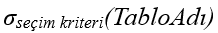

* Seçim kriterlerinde kullanılan semboller:

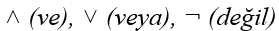

* Ogrenciler tablosundan ogrenciNo bilgisi 1512B10010 olan öğrenciyi seç.

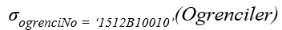

* Kisiler tablosundan cinsiyeti Erkek olan ve yaşı 18’den büyük olan kayıtları seç.

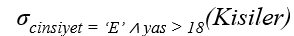

### Projeksiyon \(Projection\) İşlemi

* Bir tablodan yalnızca belirli niteliklere ait bilgiler seçilerek gösterilir.
* Tekrar eden satırlar bir kere gösterilir.
* Gösterim: 

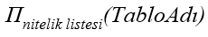

* Birden fazla nitelik varsa nitelikler birbirlerinden virgül ile ayrılır.
* Ogrenciler tablosundaki tüm kayıtların ogrenciNo, ad ve soyad bilgilerini göster.

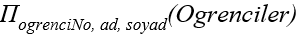

* Ogrenciler tablosundan fakülte numarası 12 olan tüm kayıtların ad ve soyad bilgilerini göster.

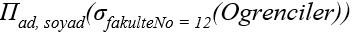

### Küme Birleşimi \(Set Union\) İşlemi

* İki tablonun küme birleşimi alınarak gösterilir.
* Tabloların nitelik sayısı aynı olmalı.
* Tabloların aynı sıradaki niteliklerinin değer alanları aynı olmalı.
* Küme birleşimi işlemi sonrasında birbirinin aynısı olan satırlar bir kez getirilir.
* Gösterim: 

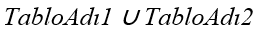

* BilgisayarToplulugu ve SiberToplulugu tablolarındaki kayıtların ogrenciNo, ad ve soyad alanlarındaki bilgileri birleştir ve göster.

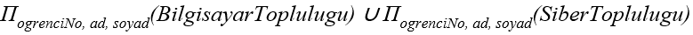

### Küme Kesişimi \(Set Intersection\) İşlemi

* İki tablonun küme kesişimi alınarak gösterilir.
* Tabloların nitelik sayısı aynı olmalı.
* Tabloların aynı sıradaki niteliklerinin değer alanları aynı olmalı.
* Gösterim: 

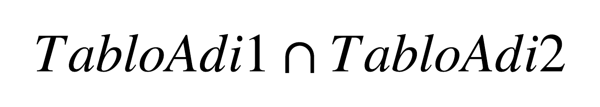

* BilgisayarToplulugu ve SiberToplulugu tablolarındaki kayıtların ogrenciNo, ad ve soyad alanlarındaki bilgileri aynı olan kayıtların bu alanlardaki bilgilerini seç ve göster.

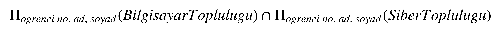

### Küme Farkı \(Set Difference\) İşlemi

* İki tablonun küme farkı alınarak gösterilir.
* Tabloların nitelik sayısı aynı olmalı.
* Tabloların aynı sıradaki niteliklerinin değer alanları aynı olmalı.
* Gösterim: 

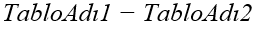

* BilgisayarToplulugu ve SiberToplulugu tablolarındaki kayıtların ogrenciNo, ad ve soyad alanlarındaki bilgileri seç ve bu bilgilere göre karşılaştırma yap.
* BilgisayarTopluluğu tablosunda olup da SiberToplulugu tablosunda olmayan öğrencilerin bu bilgilerini göster.

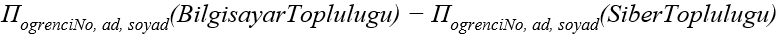

### Kartezyen Çarpım \(Cartesian Product\) İşlemi

* İki tablonun kartezyen çarpımı gerçekleştirilir.
* Farklı iki tabloya uygulanır.
* Gösterim: 

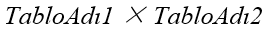

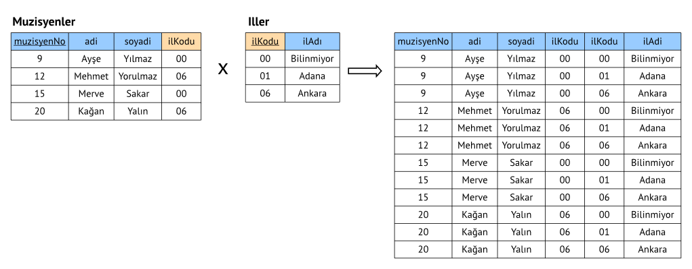

### Doğal Birleştirme/İç Birleştirme \(Natural Join/Inner Join\) İşlemi

* İki tablonun kartezyen çarpımının alt kümesi elde edilir.
* Kartezyen çarpım soncuna seçme işlemi uygulanır.
* Aynı niteliğe ait bilgileri aynı olan kayıtlar seçilerek gösterilir.
* Gösterim: 

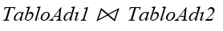

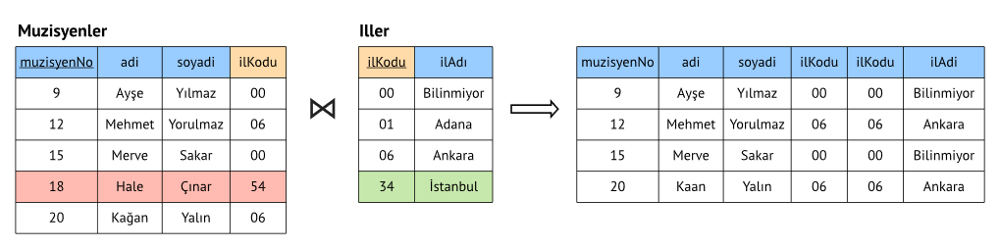

### Sol Dış Birleştirme \(Left Outer Join\) İşlemi

* İki tabloya uygulanır.
* Sol taraftaki tablodaki tüm kayıtlar alınır.
* Sağ taraftaki tablodan aynı niteliğe ait bilgileri aynı olan kayıtlar seçilir, bilgileri sol taraftaki tablodan alınan bilgilere eklenerek gösterilir.
* Sağ taraftaki tabloda eşleşen kayıt yoksa bunların yeri boş bırakılır \(NULL\).
* Gösterim: 

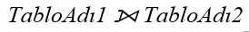

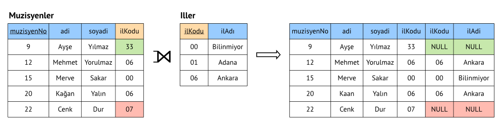

### Sağ Dış Birleştirme \(Right Outer Join\) İşlemi

* İki tabloya uygulanır.
* Sağ taraftaki tablodaki tüm kayıtlar alınır.
* Sol taraftaki tablodan aynı niteliğe ait bilgileri aynı olan kayıtlar seçilir, bilgileri sağ taraftaki tablodan alınan bilgilere eklenerek gösterilir.
* Sol taraftaki tabloda eşleşen kayıt yok ise bunların yeri boş bırakılır \(NULL\).
* Gösterim: 

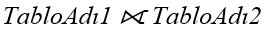

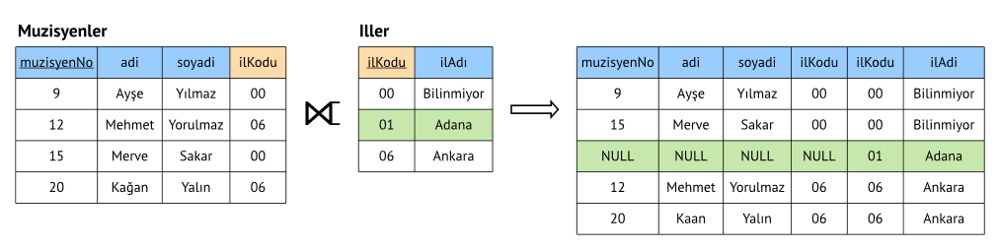

### Bölme \(Divison\) İşlemi

* İki tabloya uygulanır.
* İki tablonun bir ortak niteliği olması gerekir.
* Gösterim: 

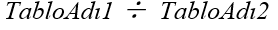

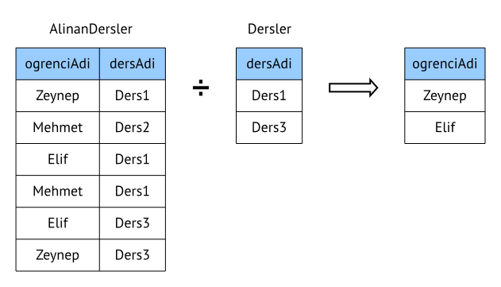

### Uygulama

* Üçüncü hafta ders notlarında geliştirilen Üniversite Bilgi Sistemine ait veritabanının ilişkisel şeması \(alt şema\) aşağıdaki gibidir. İstenen sorgulara ait biçimsel ifadeleri ilişkisel cebir ile yapınız.

#### İlişkisel Şema

* Bolum \(**bolumNo: int**, ad: varchar\(20\)\)
* Ogrenci \(**ogrenciNo: char\(10\)**, ad: varchar\(20\), soyad: varchar\(20\), dogumTarihi: date, dogumYeri: varchar\(16\), cinsiyet: char\(1\), bolumNo: int\)
* AcilanDers \(**dersNo: char\(6\)**, dersKodu: char\(5\), donem: varchar\(10\), sicilNo: char\(7\), bolumNo: int\)
* Kayit \(**kayitNo: int**, dersNo: char\(6\), ogrenciNo: char\(10\), vize: numeric, final: numeric, ortalama: numeric\)
* OgretimUyesi \(**sicilNo: char\(7\)**, ad: varhcar\(20\), soyad: varchar\(20\), dogumTarihi: date, dogumYeri: char\(16\), unvan: varchar\(20\)\)

#### Sorular

* Soru 1: Bütün öğrencilerin öğrenci numarası, ad ve soyadlarını listeleyen ilişkisel cebir ifadesini yazınız.
* Soru 2: Sakarya ilinde doğan öğrencilerin adını ve soyadını listeleyen ilişkisel cebir ifadesini yazınız.
* Soru 3: Bilgisayar Mühendisliği bölümünde ders veren öğretim üyelerinin ad ve soyadlarını listeleyen ilişkisel cebir ifadesini yazınız.
* Soru 4: 2016-2017 eğitim öğretim döneminde hiçbir dersi olmayan öğretim üyelerinin sicil numarası, ad ve soyadlarını listeleyen ilişkisel cebir ifadesini yazınız.
* Soru 5: Makine Mühendisliği bölümünde okuyan veya cinsiyeti kız olan öğrencilerin ad ve soyadlarını listeleyen ilişkisel cebir ifadesini yazınız.
* Soru 6: Çevre Mühendisliği bölümünde okuyan ve not ortalaması 3’ün üzerinde olan öğrencilerin öğrenci numarası bilgilerini listeleyen ilişkisel cebir ifadesini yazınız.

#### Cevaplar

* Soru1: Bütün öğrencilerin öğrenci numarası, ad ve soyadlarını listeleyen ilişkisel cebir ifadesini yazınız.

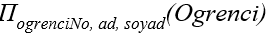

* Soru 2: Sakarya ilinde doğan öğrencilerin adını ve soyadını listeleyen ilişkisel cebir ifadesini yazınız.

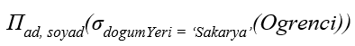

* Soru 3: Bilgisayar Mühendisliği bölümünde ders veren öğretim üyelerinin ad ve soyadlarını listeleyen ilişkisel cebir ifadesini yazınız.

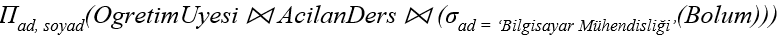

* Soru 4: 2016-2017 eğitim öğretim döneminde hiçbir dersi olmayan öğretim üyelerinin sicil numarası, ad ve soyadlarını listeleyen ilişkisel cebir ifadesini yazınız.

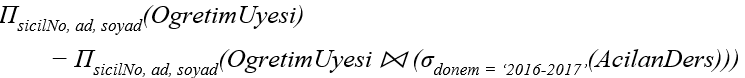

* Soru 5: Makine Mühendisliği bölümünde okuyan veya cinsiyeti kız olan öğrencilerin ad ve soyadlarını listeleyen ilişkisel cebir ifadesini yazınız.

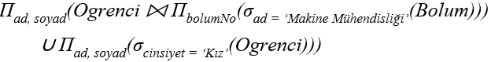

* Soru 6: Çevre Mühendisliği bölümünde okuyan ve not ortalaması 3’ün üzerinde olan öğrencilerin öğrenci numarası bilgilerini listeleyen ilişkisel cebir ifadesini yazınız.

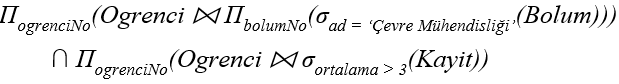

