# VYS12\_1

BSM211 Veritabanı Yönetim Sistemleri - Celal ÇEKEN, İsmail ÖZTEL, Veysel Harun ŞAHİN

## Normalizasyon

### Konular

* Normalizasyon
* Veri Tekrarının Zararları
* Birinci Normal Form \(1NF\)
* Fonksiyonel Bağımlılık
* İkinci Normal Form \(2NF\)
* Üçüncü Normal Form \(3NF\)
* 1., 2. ve 3. Normal Formlar
* Örnekler
* Kaynaklar

### Veritabanı Geliştirme Yaşam Döngüsü

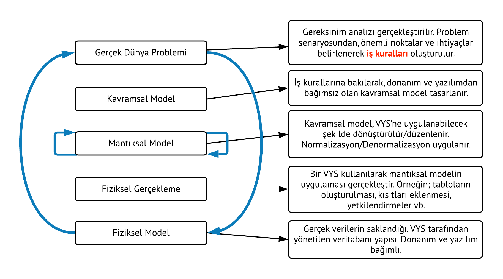

### Normalizasyon

* İyi bir veritabanı tasarımı, düzenli ve sağlam tablo tasarımlarını gerektirir.
* Normalizasyon, veri fazlalıklarını en aza indirerek veri düzensizliklerinin \(data anomaly\) önüne geçebilmek için tablo yapılarını değerlendirme ve düzeltme işlemi olarak tanımlanabilir.
* Normalizasyon işlemi normal form adı verilen seri işlemlerden meydana gelir. 1NF, 2NF, 3NF, 4NF
* 2NF 1NF den, 3NF 2NF den, ve 4NF 3NF den daha iyidir.
* Her tasarım için en yüksek NF daha iyi sonuç verir denemez. Yüksek başarıma ihtiyaç duyulan bazı durumlarda normal formun \(NF\) düşürülmesi \(denormalizasyon\) gerekebilir.
* Örneğin yüksek hız için veri fazlalığı göze alınarak zaman zaman denormalizasyon yapılabilir.
* Normalizasyonun en temel faydası, **veri tekrarını** en aza indirerek veri düzensizliklerinin \(data anomaly\) önüne geçmemize yardımcı olmasıdır.

### Veri Tekrarının Zararları

> Veri tekrarı tablo içerisine başka tablonun gömüldüğü anlamına gelir.

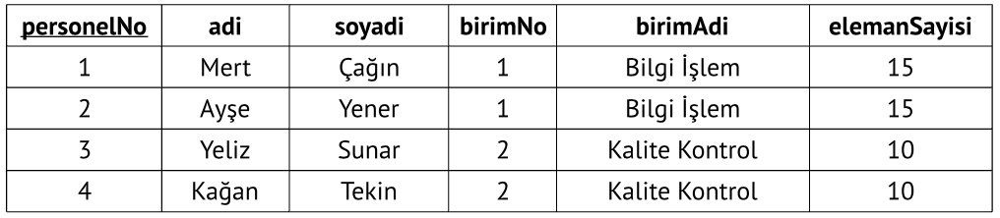

* Veri tekrarında aynı bilgi defalarca kaydedilir.
* Veri tekrarı, kaynak kullanımında israfa yol açar.
* Veri tekrarı, veri tutarsızlıklarına \(düzensizliklerine\) neden olabilir.
  * Veri girişinde tutarsızlık
  * Veri güncellenmesinde tutarsızlık
  * Veri silmede tutarsızlık

#### Veri Girişinde Tutarsızlık

* Veri tekrarı olan tablolara yeni kayıt eklenirken tutarsızlıklar oluşabilir.

> Tabloya yeni kayıt eklenirken birimAdi ve elemanSayisi sütunlarında tutarsızlık oluşmuştur.

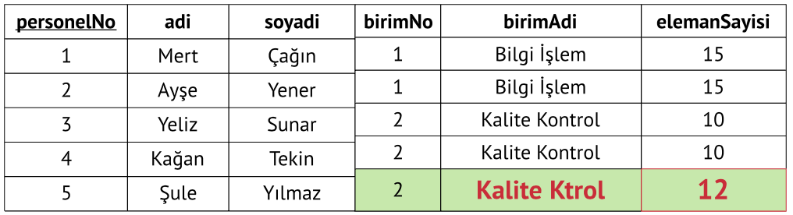

* Veri tekrarı olan tablolara birincil anahtar değerinin tekrar etmesi durumunda yeni kayıt eklenemeyebilir.

> Tabloda, personelNo alanına değer yazılamaz ve 3 nolu birim eklenemez.

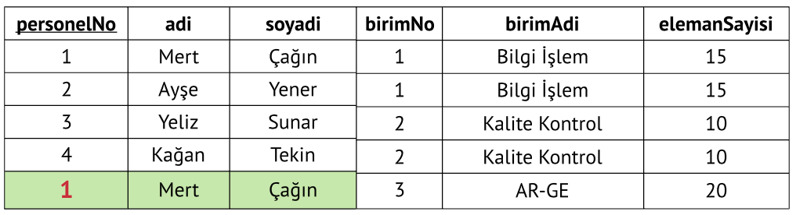

#### Veri Güncellenmesinde Tutarsızlık

* Veri güncellenirken birçok noktada değişiklik yapmak gerekir ve bu durumda tutarsızlıklar oluşabilir.

> Tabloda elemanSayısı güncellenirken tutarsızlık oluşmuştur.

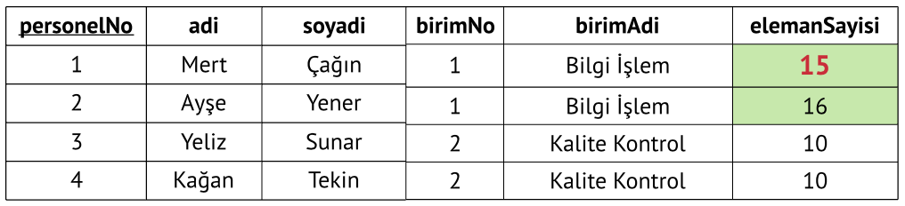

#### Veri Silmede Tutarsızlık

* Veriler silinirken başka veriler de kaybedilebilir.

> Tabloda 1 numaralı birimin elemanları silindiğinde ilgili birimin bilgileri de kaybedilir.

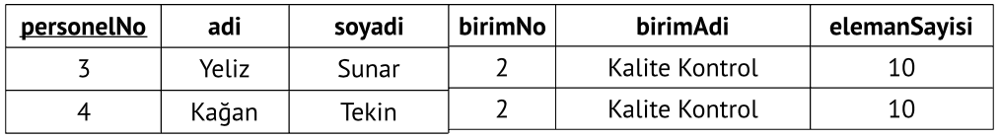

#### İyileştirilmiş Tasarım

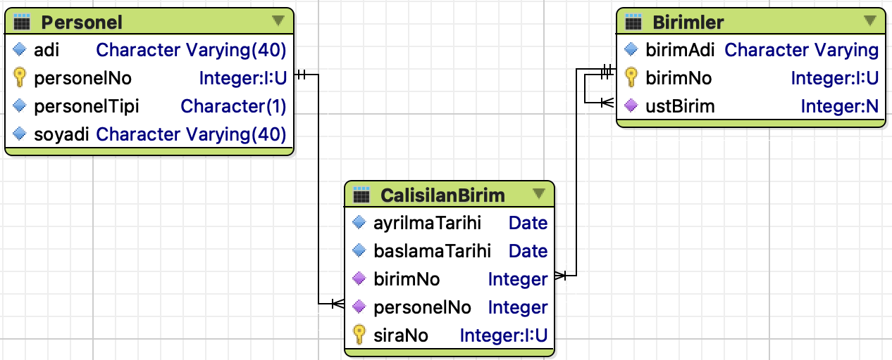

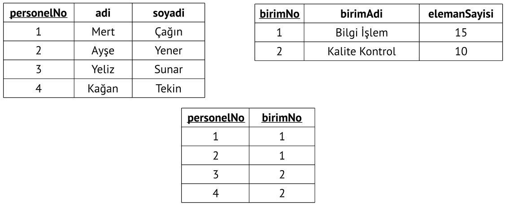

### Birinci Normal Form \(1NF\)

* Bir tablonun birinci normal formda \(1NF\) olması için aşağıdaki şartlar sağlanmalıdır.
  * Tüm alanlar birincil anahtar tarafından belirlenebilmelidir.
  * Tüm alanlar tek değerli olmalıdır.
* Aşağıdaki tablo birinci normal formda \(1NF\) değildir.
  * Çünkü ePosta sütunu tek değerli değildir.
  * Normalizasyon yapmalıyız.

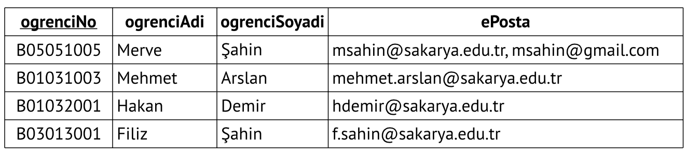

#### Normalizasyon Sonucu

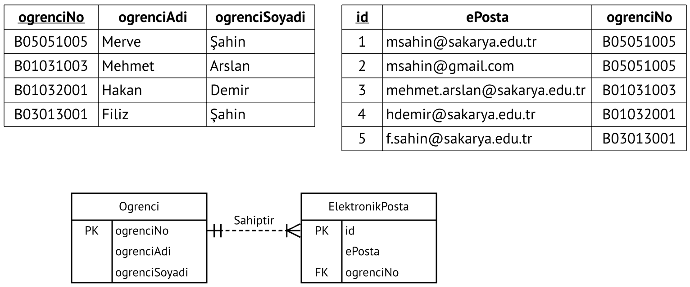

### Tekrarlanan Veri Grupları

* Aşağıdaki tablo birinci normal formdadır.
  * Tabloda birincil anahtar var.
  * Her sütunda tek değer var.
* Buna rağmen veri tekrarı vardır.

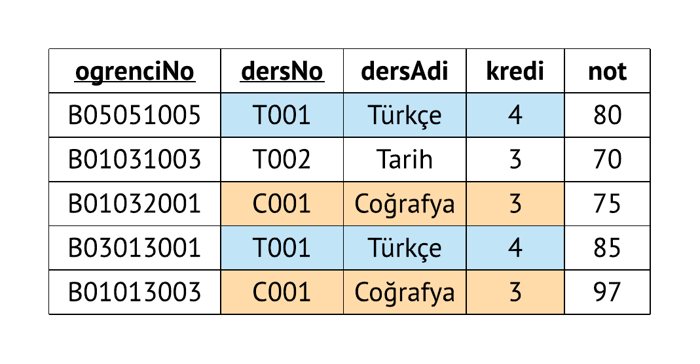

* Tablodaki tutarsızlık aşağıda gösterilmiştir.

### İkinci Normal Form \(2NF\)

#### Fonksiyonel Bağımlılık

* Kayıtların ayırt edilebilmesi, tabolar araasında ilişki kurulabilmesini sağlar.
* Anahtarlar belirlenirken fonksiyonel bağımlılık göz önüne alınmalıdır.
* Aşağıdaki tabloda, ogrenciNo niteliği kullanılarak adi alanı belirlenebilir. \(**tersi doğru değildir**\)
* Bu durumda:
  * **ogrenciNo** alanı **adi** alanını **belirler**.
  * **adi** alanı, **ogrenciNo** alanına **fonksiyonel bağımlıdır \( ogrenciNo ➔ ogrenciAdi\)**.

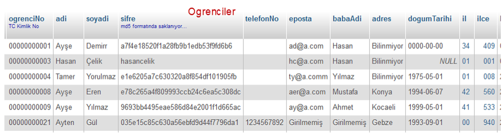

#### Tam Fonksiyonel Bağımlılık

* Nitelikler birden fazla alanın birleşimine fonksiyonel bağımlı olabilir.
  * ogrenciNo, dersNo ➔ ortalama **Tam fonksiyonel bağımlılık**
  * ogrenciNo, dersNo ➔ dersAdi **Kısmi fonksiyonel bağımlılık**

#### İkinci Normal Form Şartları

* Tablonun birinci normal formda olması gerekir.
* Birincil anahtar, birden fazla alanın birleşiminden oluşuyorsa, tablonun 2NF’de olabilmesi için diğer alanların birincil anahtara **tam fonksiyonel bağımlı** olması gerekir.
* Birincil anahtar tek alandan oluşuyorsa ve tablo 1NF’de ise, 2NF de sağlanmış olur.

#### Örnek

* Birincil anahtar ogrenciNo ve dersNo alanlarından oluşan bileşik birincil anahtardır.
* not alanı birincil anahtara **tam fonksiyonel bağımlıdır**.
* dersAdi ve kredi alanları birincil anahtara **kısmi fonksiyonel bağımlıdır** ve bu nedenle tablo ikinci normal formda \(2NF\) değildir. Veri tekrarı meydana gelmiştir.

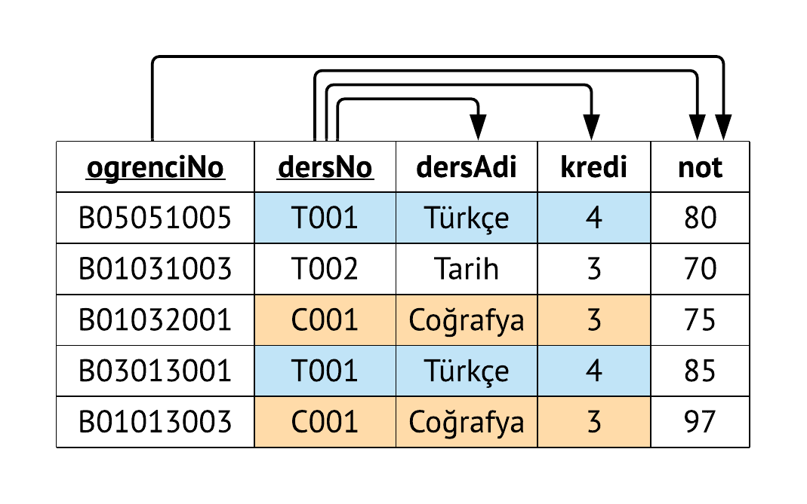

#### Tabloyu 2NF'ye Dönüştürme \(Kısmi Bağımlılıkların Giderilmesi\)

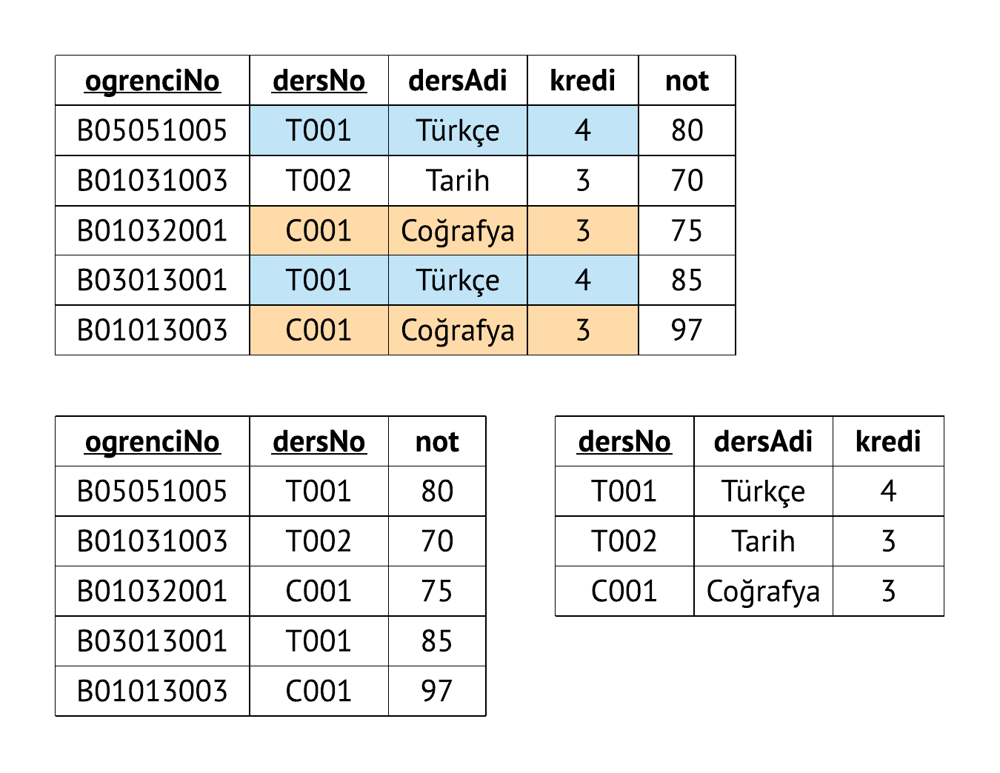

### Üçüncü Normal Form \(3NF\)

#### Geçişken Bağımlılık

* Eğer A ➔ B ve B ➔ C ise A ➔ B ➔ C
  * A, B üzerinden C’yi belirler.
  * C, A ya geçişken bağımlıdır.
* Aşağıdaki tabloda geçişken bağımlılık vardır.
  * oduncNo ➔ ISBNNo ➔ kitapAdi
  * oduncNo ➔ ISBNNo ➔ yayinYili
  * oduncNo alanı, ISBNNo alanı üzerinden kitapAdi alanını belirler.
  * kitapAdi alanı, oduncNo alanına geçişken bağımlıdır.

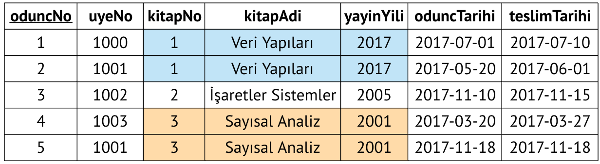

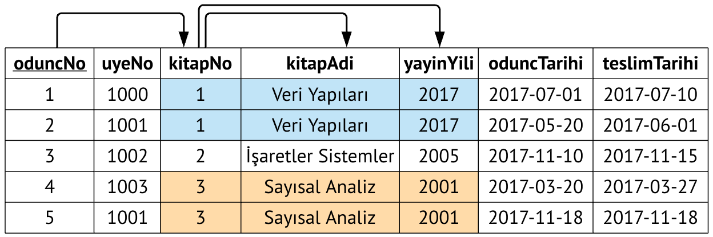

#### Üçüncü Normal Form Şartları

* Tablo 2NF’de ise ve geçişken bağımlılık yok ise 3NF’dedir.

#### Tabloyu 3NF’ye Dönüştürme

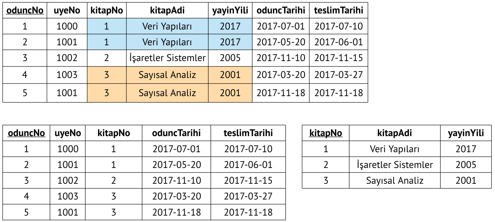

#### Özet

* 1NF: Birincil anahtar mevcuttur ve çok değerli alanlar yoktur.
* 2NF: Birinci normal formdadır ve kısmi bağımlılık yoktur.
* 3NF: İkinci normal formdadır ve geçişken bağımlılık yoktur.

#### Örnek 1

* Tablodaki veri tekrarının nedenini ve nasıl düzeltilebileceğini açıklayınız.

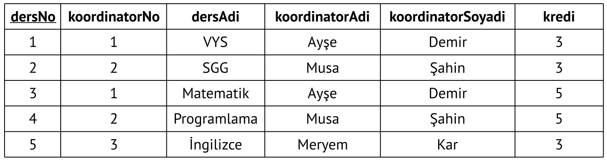

#### Örnek 2

* Tablodaki veri tekrarının nedenini ve nasıl düzeltilebilceğini açıklayınız.

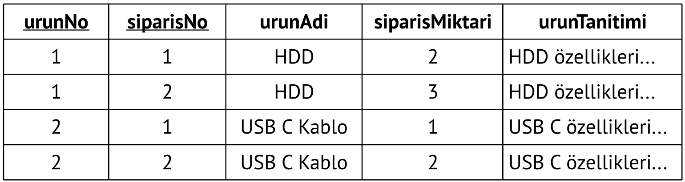

